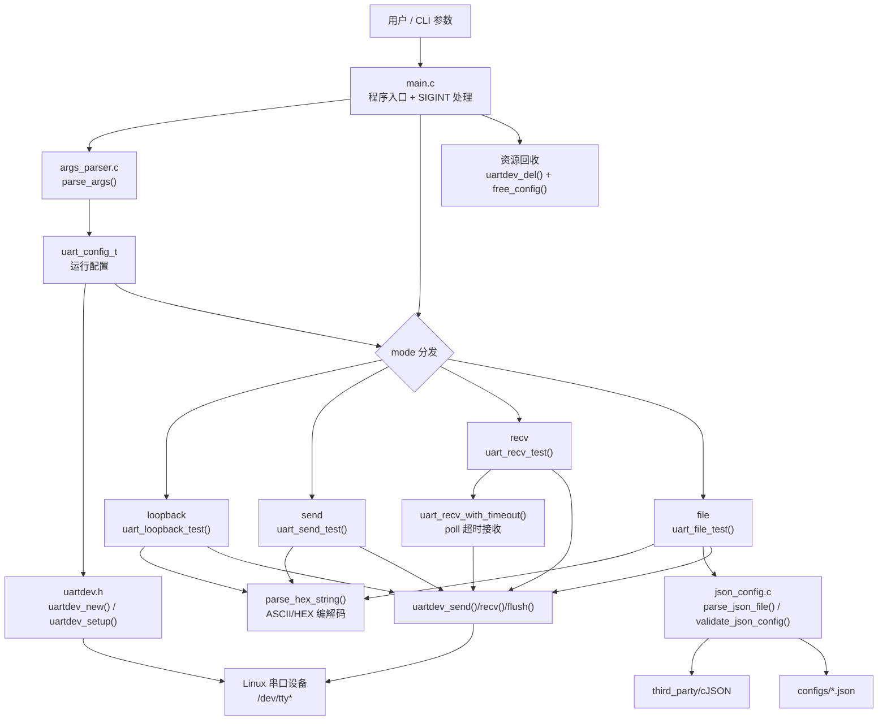

# uart_assist 项目架构图

基于当前代码（`src/main.c`、`src/args_parser.c`、`src/uart_assist.c`、`src/json_config.c`、`inc/uartdev.h`）整理。

## 模块职责

- `main.c`：流程编排与生命周期管理（信号、模式选择、资源释放）。
- `args_parser.c`：命令行解析、默认值填充、参数合法性校验。
- `uart_assist.c`：四种业务模式实现与收发格式处理。
- `json_config.c`：`file` 模式 JSON 解析与配置校验。
- `uartdev.h`：串口底层操作封装（open/termios/read/write/poll 相关支持）。
- `third_party/cJSON`：JSON 解析依赖。
